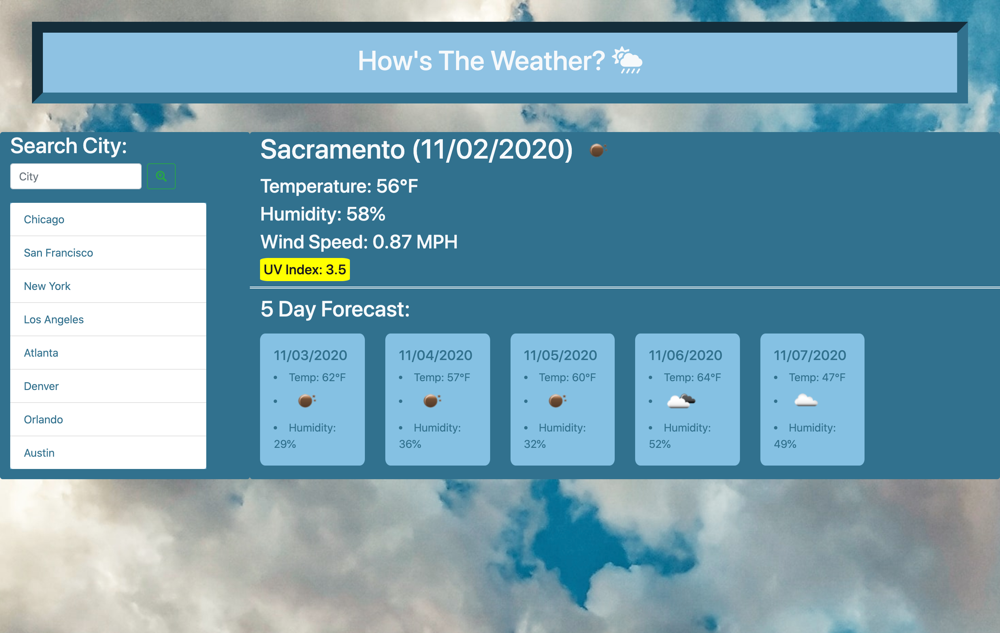

# HowsTheWeather

## What it is

*HowsTheWeather is a simple weather page that allows the user to search by city and get current weather as well as a five day forecast coming up.

## Components

* Allows you to search for a city and then pulls up current and future conditions for that city using Open Weather API.

* Searched cities are added to the search history.

* Presented with the city name, the date, an icon representation of weather conditions, the temperature, the humidity, the wind speed, and the UV index.

* The UV Index has a background color that indicates whether the conditions are favorable, moderate, or severe.

* 5-day forecast that displays the date, an icon representation of weather conditions, the temperature, and the humidity.

* Can click on search history cities and be taken back to weather information about them.

* When Returning to the site, you are presented with the last searched city forecast via your local Storage.

## Technologies

* HTML
* CSS
* Bootstrap framework
* JavaScript
* jQuery
* Moment.js

## Resources

* OpenWeather API to pull weather information.
* Unsplash for public use background image

## Website Example and Link

[Go to Live HowsTheWeather Page](https://beccablanton.github.io/HowsTheWeather/)

## License

MIT License. see License file for details.

### Author

Sole Author: Contact [Becca Blanton](https://beccablanton.github.io/)
